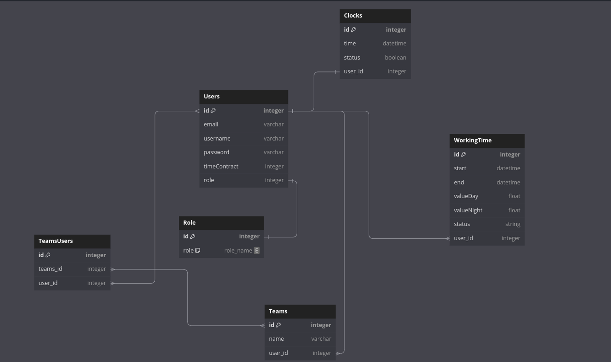
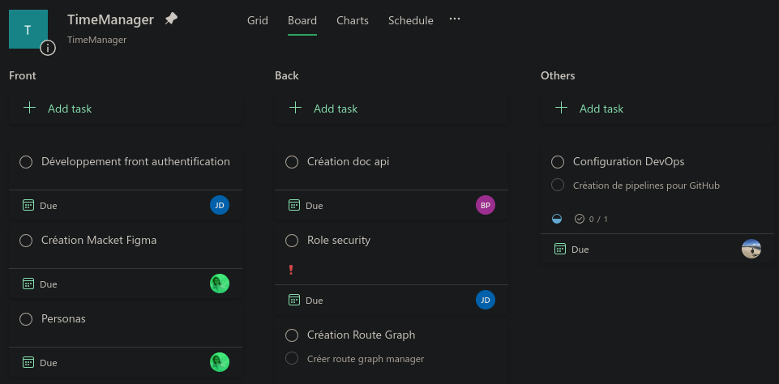

<a name="readme-top"></a>

<!-- PROJECT LOGO -->
<br />
<div align="center">
  <a href="https://github.com/EpitechMscProPromo2025/T-POO-700-NAN_9">
    
  </a>

  <h3 align="center">GoTime</h3>

  <p align="center">
    An awesome time manager to manage your time and your teams!
    <br />
    <br />
    <br />
  </p>
</div>

<!-- ABOUT THE PROJECT -->

## About The Project

You can see here the
[Repo](https://github.com/EpitechMscProPromo2025/T-POO-700-NAN_9)

Or the [Mirror](https://github.com/tistech0/GoTime) of the project were we can use the github actions

This is the first Epitech project in the MSc cursus. This project aims at creating a time manager app.

#### To give you some context :

_We are in Gotham city and the people have to repair all the batman destruction. They do a lot of extra time and work at night. They need a time manager to manage their time and their teams. That's why we created GoTime._

_GoTime is a time manager to manage your time and your teams. There is 3 categories of users : User, Manager, Global manager. Each category of user has different rights on the website._

_The app give you the opportunity to check-up every day and keep a trace of your work. If it's an extra time or if it's a night time, it's rensured that you will be paid for it._

_The app also give you the opportunity to manage your teams. You can create a team, add members to it, and manage the time of each member of your team._

_To help you be the most efficient, the app give you the opportunity to see quickly with the help of graph your time and the time of your teams._

_The service provied also a mobile app to be able to use it everywhere._

#### The project is composed of 7 parts :

- The API in Elixir
- The web app in Vue.js
- The dev ops part with Docker Kubernetes and CI/CD
- The design thinking part with the personas, the user story map, the graphic charter, the maquette and the prototype
- The authentication part
- The mobile app with capacitor
- The security part

<p align="right">(<a href="#readme-top">Back to the top</a>)</p>

---

## Database Schema

<a href="https://dbdiagram.io/d/6537c193ffbf5169f0588785">

</a>

When we have started the project, we have take a moment to think how our data would be organized. We have decided to use a relational database. We have created a database diagram to use it as a guide during the project. We have used [DbDiagram](https://dbdiagram.io/home) to create it.

---

## Project management

<a href="https://tasks.office.com/epitechfr.onmicrosoft.com/Home/PlanViews/3zEW8ZEJD02irspfcFwa0JYAEexq?Type=PlanLink&Channel=Link&CreatedTime=638345289978310000">
    
</a>

For all the project, we wanted to have some kind of project management. We have decided to use [Planner](https://tasks.office.com/epitechfr.onmicrosoft.com/Home/PlanViews/3zEW8ZEJD02irspfcFwa0JYAEexq?Type=PlanLink&Channel=Link&CreatedTime=638345289978310000) to manage our project. We have created tasks and assigned them to the different members of the team. We add a description to each task. We also have a calendar to see the deadlines of the tasks and manage progression and priorities. We also have some bucket to organize our tasks.

---

### Built With

Why ? Because Elixir and Vue.js was a constraint of the project.

- [![Elixir][elixir.com]][elixir-url]
- [![Vue][vue.js]][vue-url]
- [![TypeScript][typescript.com]][typescript-url]
- [![Apexcharts][apexcharts.com]][apexcharts-url]
- [![Vuetify][vuetify.com]][vuetify-url]
- [![Node.js][node.js]][node-url]
- [![PostgreSQL][postgresql.com]][postgresql-url]
- [![Docker][docker.com]][docker-url]
- [![GithubCi][githubci.com]][githubci-url]
- [![SonarQube][sonarqube.com]][sonarqube-url]
- [![Tailwind][tailwind.com]][tailwind-url]

<p align="right">(<a href="#readme-top">Back to the top</a>)</p>

---

<!-- GETTING STARTED -->

## Getting Started

### Prerequisites

You must install:

- docker/docker-compose

### Installation

0. Make yourself a good coffee ☕

1. Clone the repo

   ```sh
   git clone https://github.com/EpitechMscProPromo2025/T-POO-700-NAN_9.git
   ```

2. Configure your environnment

   Rename the `.env.example` files as `.env`. Create a new database and set the variables in the .env file in order to configure your environment.

> Again: You need to replace the variables in your `.env` file with your own values.

4. Run the app with docker

   ```sh
   docker-compose up
   ```

   Your website should be available at http://localhost:4000

   The website is also available at TODO (the deployed version)

      <p align="right">(<a href="#readme-top">Back to the top</a>)</p>

### Initialisation mobil app

1. Install capacitor

   ```sh
   npm install -g @capacitor/cli
   npx cap init Gotime eu.gotime.app --web-dir=dist
   ```

2. Build the app
   ```sh
   npm run build
   ```
3. Install the native platforms
   ```sh
   npm i @capacitor/ios @capacitor/android
   npx cap add android
   npx cap add ios
   ```
4. Sync the app
   ```sh
    npx cap sync
   ```

### Generate the apk android

1. Open the android project in android studio
2. Build the project
3. Generate the apk

---

<p align="right">(<a href="#readme-top">Back to the top</a>)</p>

---

<!-- ACKNOWLEDGMENTS -->

## Acknowledgments

Some useful links we used during the project and would like to give credit to.

- [Markdown badges](https://github.com/Ileriayo/markdown-badges)
- [Mdi icons](https://pictogrammers.com/library/mdi/)
- [JsonWebToken](https://www.npmjs.com/package/jsonwebtoken)
- [Bcrypt](https://www.npmjs.com/package/bcrypt)
- [Dotenv](https://www.npmjs.com/package/dotenv)
- [DbDiagram](https://dbdiagram.io/home)
- [Notion](https://www.notion.so/)

<p align="right">(<a href="#readme-top">Back to the top</a>)</p>

---

# Thank you for reading this README 🎉

<!-- MARKDOWN LINKS & IMAGES -->
<!-- https://www.markdownguide.org/basic-syntax/#reference-style-links -->

[vue.js]: https://img.shields.io/badge/Vue.js-35495E?style=for-the-badge&logo=vue.js&logoColor=4FC08D
[vue-url]: https://vuejs.org/
[typescript.com]: https://img.shields.io/badge/TypeScript-007ACC?style=for-the-badge&logo=typescript&logoColor=white
[typescript-url]: https://www.typescriptlang.org/
[node.js]: https://img.shields.io/badge/Node.js-43853D?style=for-the-badge&logo=node.js&logoColor=white
[node-url]: https://nodejs.org/en/
[express.com]: https://img.shields.io/badge/Express.js-404D59?style=for-the-badge
[express-url]: https://expressjs.com/
[vuetify.com]: https://img.shields.io/badge/Vuetify-1867C0?style=for-the-badge&logo=vuetify&logoColor=white
[vuetify-url]: https://vuetifyjs.com/en/
[postgresql.com]: https://img.shields.io/badge/PostgreSQL-316192?style=for-the-badge&logo=postgresql&logoColor=white
[postgresql-url]: https://www.postgresql.org/
[prisma.com]: https://img.shields.io/badge/Prisma-2D3748?style=for-the-badge&logo=prisma&logoColor=white
[prisma-url]: https://www.prisma.io/
[docker.com]: https://img.shields.io/badge/Docker-2CA5E0?style=for-the-badge&logo=docker&logoColor=white
[docker-url]: https://www.docker.com/
[elixir.com]: https://img.shields.io/badge/Elixir-4B275F?style=for-the-badge&logo=elixir&logoColor=white
[elixir-url]: https://elixir-lang.org/
[apexcharts.com]: https://img.shields.io/badge/ApexCharts-000000?style=for-the-badge&logo=apexcharts&logoColor=white
[apexcharts-url]: https://apexcharts.com/
[githubci.com]: https://img.shields.io/badge/Github_CI-181717?style=for-the-badge&logo=github&logoColor=white
[githubci-url]: https://resources.github.com/ci-cd/
[sonarqube.com]: https://img.shields.io/badge/SonarQube-4E9BCD?style=for-the-badge&logo=sonarqube&logoColor=white
[sonarqube-url]: https://www.sonarqube.org/
[tailwind.com]: https://img.shields.io/badge/Tailwind_CSS-38B2AC?style=for-the-badge&logo=tailwind-css&logoColor=white
[tailwind-url]: https://tailwindcss.com/
